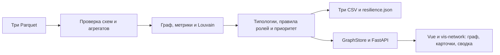

# Граф денег

Инструмент для AML-аналитика банка: по обезличенной выгрузке переводов строит
направленный граф, присваивает объяснимые роли, выделяет сообщества и ранжирует
клиентов для углублённой проверки. Основной вопрос: **кого смотреть первым и почему?**

HackAlem AI, 23.09.2026. Команда «Калифорнийское бюро расследований»:
Аяган Елнур, Кайсарбеков Аргын, Пермин Константин.

Роли и типологии — гипотезы по наблюдаемым данным, не утверждения о виновности.
Внешние сведения о клиентах не используются. GPU, API-ключ и платные сервисы
для расчёта и интерфейса не нужны.

## 1. Быстрый запуск через Docker

**На Windows рекомендуем этот способ: отдельно устанавливать Python и активировать
`.venv` не требуется.** Нужен работающий Docker Desktop в режиме Linux containers;
на Windows — с WSL 2. [Официальная инструкция установки](https://docs.docker.com/desktop/setup/install/windows-install/).
Compose входит в Docker Desktop: [документация](https://docs.docker.com/compose/install/).

Скачайте репозиторий через Git либо распакуйте ZIP. Все команды выполняются
из папки с `docker-compose.yml`:

```bash
git clone https://github.com/BAITC-Hacks/hack-4cea2b8e-team.git
cd hack-4cea2b8e-team
docker --version
docker compose version
docker info
```

Если репозиторий уже скачан, повторять клонирование не нужно. Запустите Docker
Desktop до выполнения команд. Поместите три файла организаторов в `data/`:

```text
data/
  edges.parquet
  nodes.parquet
  transactions.parquet
```

**Запуск приложения одной командой:**

```bash
docker compose up --build -d
```

Откройте **[http://localhost:8000/](http://localhost:8000/)** — сразу появится граф.
Если файлов пока нет, сервер всё равно запустится и предложит форму загрузки.
Для замены набора нажмите **«⇧ Загрузить датасет»** рядом со «Сводкой».
Форма принимает три непустых Parquet-файла, каждый размером до 100 МиБ.

Первая сборка требует интернета для базового образа и зависимостей. После сборки
анализ и интерфейс работают локально без интернета. `.env` и LLM-ключ не нужны.

### Проверка готовности и управление

```bash
docker compose ps
docker compose logs --tail=100 app
```

В [ответе health](http://localhost:8000/api/health) ожидаются `status: "ok"`,
а после загрузки данных — `data_ready: true` и `graph_loaded: true`.
Для выборки трека `n_nodes` равно 2248. Статус контейнера `healthy` сам по себе
подтверждает доступность сервера, но не наличие данных.

```bash
docker compose stop
docker compose start
```

После изменения кода повторите `docker compose up --build -d`.

### Если порт 8000 занят

Выберите свободный порт, например 8002. PowerShell:

```powershell
$env:GRAPH_PORT = "8002"
docker compose up --build -d
```

macOS/Linux:

```bash
GRAPH_PORT=8002 docker compose up --build -d
```

Откройте `http://localhost:8002/`; в остальных URL также замените 8000 на 8002.
Внутренний порт контейнера остаётся 8000. При последующих `up` сохраняйте выбранное
значение `GRAPH_PORT`. Публикация порта ограничена локальным компьютером.

Если нужно сохранить старые контейнеры этого же проекта, запускайте отдельную
копию через `docker compose -p money-graph-current up --build -d`. Для этой копии
используйте `-p money-graph-current` и в командах `ps`, `logs`, `exec`, `cp`, `stop`, `start`.

## 2. Один запуск от Parquet до CSV

После сборки и запуска контейнера, при наличии исходных файлов в `data/`:

```bash
docker compose exec app python -m pipeline.run --data /app/data --out /app/out
```

Команда проверяет входные данные, рассчитывает роли и кластеры, создаёт все три
обязательные выгрузки и дополнительный `resilience.json`. По умолчанию топ содержит
25 узлов. `--top N` меняет размер; на достаточно большой сети минимум — 20.

Сохраните обязательные результаты на компьютер:

```bash
docker compose cp app:/app/out/nodes_roles.csv ./nodes_roles.csv
docker compose cp app:/app/out/clusters.csv ./clusters.csv
docker compose cp app:/app/out/top_nodes.csv ./top_nodes.csv
```

`/app/out` находится внутри контейнера: скопируйте результаты до его пересоздания.
Не добавляйте полученные CSV в коммит автоматически — сдайте их отдельно по правилам
организаторов. Каталоги `data/` и `out/` исключены из Git.

### Если набор загружен через браузер

Форма проверяет схемы, сверяет агрегаты рёбер с транзакциями и выполняет расчёт
до активации. При ошибке прежний набор остаётся доступным. Версии сохраняются
в `data/.uploads/<dataset_id>/`; указатель `data/.active-dataset` выбирает активную
версию. Папка `data/` подключена к контейнеру и сохраняется после перезапуска.

**CLI читает только каталог `--data`, а HTTP-экспорт — активный набор интерфейса.**
Для загруженного через форму набора скачайте обязательные файлы по ссылкам:

- [nodes_roles.csv](http://localhost:8000/api/export/nodes_roles.csv)
- [clusters.csv](http://localhost:8000/api/export/clusters.csv)
- [top_nodes.csv](http://localhost:8000/api/export/top_nodes.csv)

Либо передайте CLI каталог `/app/data/.uploads/<dataset_id>` вместо `/app/data`.
Не сравнивайте граф одного набора с CSV другого. Замена исходных файлов в `data/`
не отменяет уже выбранную загруженную версию. Другую открытую вкладку графа после
смены набора нужно обновить. Автоматической очистки старых версий пока нет.

## 3. Версии и запуск без Docker

| Компонент | Версия |
|---|---|
| Docker | Docker Desktop с Linux containers и плагином `docker compose` (v2 или новее) |
| Python | 3.12 в Docker (`python:3.12-slim`); без Docker — 3.11 или 3.12 |
| FastAPI / Uvicorn / Pydantic | 0.115.6 / 0.34.0 / 2.10.4 |
| pandas / NetworkX / PyArrow | 2.2.3 / 3.4.2 / 18.1.0 |
| pytest / httpx | 8.3.4 / 0.28.1 |
| Vue / vis-network | 3.5.22 / 9.1.9, локальные файлы в `web/vendor/` |

Все прямые Python-зависимости — в [requirements.txt](requirements.txt).
Образ `python:3.12-slim` обновляемый: patch-версия и digest не закреплены;
транзитивные Python-зависимости также не зафиксированы отдельным lock-файлом.
Сборка не заявляется побитово воспроизводимой. Node.js и npm для запуска не нужны.

### Windows PowerShell

При установленном Python 3.12, из корня проекта:

```powershell
py -3.12 -m venv .venv
.\.venv\Scripts\Activate.ps1
python -m pip install -r requirements.txt
python -m pipeline.run --data data --out out
$env:DEMO_MODE = "1"
python -m uvicorn app.main:app --host 127.0.0.1 --port 8000
```

В Windows CMD активация выполняется командой `.venv\Scripts\activate.bat`.
Если PowerShell запрещает `Activate.ps1`, активация необязательна: вместо `python`
во всех последующих командах используйте `.\.venv\Scripts\python.exe`.
Не переносите готовую `.venv` с macOS на Windows — создайте её заново.

### macOS/Linux

```bash
python3.12 -m venv .venv
source .venv/bin/activate
python -m pip install -r requirements.txt
python -m pipeline.run --data data --out out
DEMO_MODE=1 python -m uvicorn app.main:app --host 127.0.0.1 --port 8000
```

При Python 3.11 замените первую команду на `python3.11 -m venv .venv`.
Python 3.9 не подходит. Откройте [главную страницу](http://localhost:8000/).
Адреса `/graph` и `/graph.html` также работают. Остановка — Ctrl+C.
`DEMO_MODE=1` относится только к стартовому LLM-модулю: граф всегда рассчитывается
по Parquet, без демонстрационной подмены.

Для повторного запуска достаточно активировать окружение и запустить Uvicorn.
`DATA_DIR` задаёт каталог данных сервера, `DB_PATH` — SQLite стартового модуля;
CLI использует собственный `--data`. Запускайте один процесс, без `--workers`.

### Автономная установка без Docker

На машине с теми же ОС, архитектурой и версией Python заранее подготовьте пакеты:

```bash
python -m pip download --only-binary=:all: -r requirements.txt -d wheelhouse
```

Перенесите репозиторий, данные и `wheelhouse` на целевую машину:

```bash
python -m pip install --no-index --find-links=wheelhouse -r requirements.txt
```

Граф, загрузка, поиск и сводка не используют CDN. Swagger `/docs` — вспомогательная
страница с внешними ресурсами; автономный контракт доступен через `/openapi.json`
и [app/API.md](app/API.md).

## 4. Вход и точная схема результатов

Данные трека: внутрибанковские переводы за 1–31 июля 2026, исходящий обход
от 81 seed-клиента до четырёх колен, операции от 5 000 ₸.

| Файл | Обязательные поля | Объём |
|---|---|---:|
| edges.parquet | src, dst, sum_kzt, n_tx, depth | 3 119 рёбер |
| nodes.parquet | gid, depth, is_seed | 2 248 узлов |
| transactions.parquet | src, dst, date, sum_kzt | 4 840 операций |

Три обязательных CSV содержат **только следующие колонки в указанном порядке**:

| Файл | Колонки |
|---|---|
| nodes_roles.csv | gid, role, role_score, cluster_id, priority_score, evidence |
| clusters.csv | cluster_id, n_nodes, n_seed, sum_kzt_internal, top_gids, hypothesis |
| top_nodes.csv | rank, gid, role, priority_score, why |

`gid` сохраняется как int64; `cluster_id`, счётчики и ранг — целые числа,
оценки и суммы — числовые, остальные поля — текстовые. `role_score` и
`priority_score` находятся в диапазоне 0–1; `evidence` непустой, до 200 символов.
`top_gids` — до пяти приоритетных gid кластера, разделённых `|`.
При импорте в Excel задавайте gid текстом, чтобы не потерять точность длинных номеров.
В JSON API идентификаторы передаются строками, их нельзя преобразовывать в JavaScript Number.

Дополнительные файлы по флагу `--extended`:

- `nodes_roles_extended.csv`: поля обязательной таблицы узлов плюс `typologies`, `typology_evidence`.
- `top_nodes_extended.csv`: поля обязательного топа плюс `typologies`.

Например: `python -m pipeline.run --data data --out out --extended`.
Флаг не меняет схему обязательных CSV. Без него расширенные файлы не создаются
и не обновляются. Типологии разделены `|`; пустая строка означает отсутствие
срабатываний. Расширенные версии доступны также через `/api/export/{filename}`.
`resilience.json` содержит оценку удаления топ-N узлов из наблюдаемого графа.

## 5. Критерии ролей и пороги

Все пороги — в `THRESHOLDS` файла [pipeline/roles.py](pipeline/roles.py).
Обозначения: `P` — число разных плательщиков, `R` — число разных получателей,
`K = sum_out / sum_in` в пределах выборки.

`truncated` означает глубину ≥4 при отсутствии исходящих. `ratio_reliable`
истинен только для не-seed, не-обрезанного узла с положительными входящими.
Это разрешение применить отношение в эвристике, а не гарантия полного баланса.
Правила проверяются **сверху вниз**, назначается первая подходящая роль:

| Порядок | Роль | Условие | role_score |
|---|---|---|---:|
| 1 | peripheral | truncated: дальнейшие исходящие не видны | 0,20 |
| 2 | coordinator | P ≥5 и R ≥5 | 0,70 |
| 3 | consolidator | P ≥8, ratio_reliable и K ≤0,5 | 0,80 |
| 4 | distributor | R ≥20 | 0,80 |
| 5 | transit | ratio_reliable и 0,8 ≤K ≤1,2 | 0,75 |
| 6 | terminal | ratio_reliable, K ≤0,1, sum_in ≥1 000 000 ₸ | 0,75 |
| 7 | peripheral | остальные случаи | 0,30 |

`evidence` объясняет сработавшее правило конкретными метриками клиента.
`role_score` — заданная эвристическая оценка правила, не обученная вероятность.
Размеченных ролей нет, accuracy не заявляется. Пороги требуют экспертной проверки;
несрабатывание правил не означает отсутствия риска.

## 6. Ранжирование, типологии и кластеры

```text
priority_score = 0,5 × вес роли
               + 0,3 × (sum_in + sum_out) / максимальный оборот клиента
               + 0,2 × (P + R) / максимальное число связей клиента
```

Вес роли: coordinator 1,0; consolidator 0,9; distributor 0,7; terminal 0,6;
transit 0,5; peripheral 0,1. При нулевом максимуме соответствующее слагаемое
равно нулю. Оценка округляется до четырёх знаков; сортировка — по убыванию оценки,
затем gid по возрастанию. API раскрывает слагаемые в `priority_breakdown`.
`why` объясняет роль; формула выше объясняет место в приоритете.

В текущем топ-25: 18 coordinator, 4 consolidator, 3 distributor. Перекос вызван
порядком правил и весами, а не доказывает наличие 18 организаторов. Проверка
чувствительности порогов и пересечения правил ещё не выполнена.

Типологии независимы от основной роли, у узла может быть несколько признаков:

| Признак | Правило |
|---|---|
| structuring | ≥4 операции одной пары, коэффициент вариации сумм ≤0,35, весь период пары ≤7 дней |
| layering | ≥70% наблюдаемых входящих сопоставлены с исходящими за 0–2 дня; FIFO без повторного расходования суммы |
| synchronized-inflow | ≥3 разных плательщиков в один день |
| round-tripping | участие в направленных циклах длиной до 4 |

Совпадение дат не доказывает движение тех же денег; время внутри дня неизвестно.
Правило повторных сумм может пропустить короткий всплеск внутри длинного периода.
Циклы показывают возвратные связи, но не доказанный возврат средств.

Кластеры рассчитываются взвешенным Louvain с seed=42 на неориентированной
проекции: встречные суммы складываются. Изолированные узлы сохраняются.
`sum_kzt_internal` включает только рёбра с обоими концами внутри кластера.
Гипотеза назначения сообщества строится по составу ролей.

## 7. Сценарий аналитика и демо на 5 минут

1. **0:00–1:00.** Запустить пайплайн, показать время и три обязательных CSV.
2. **1:00–2:00.** Открыть граф, выбрать клиента из топа или найти gid.
   Объяснить роль по числам в карточке и её отличие от приоритета проверки.
3. **2:00–3:00.** Нажать на стрелку, показать сумму и операции пары;
   перейти к отправителю/получателю, воспользоваться историей.
4. **3:00–4:00.** Разобрать seed с «Н/Д» и узел четвёртого колена:
   неполный баланс и отсутствие видимых исходящих не доказывают удержание денег.
5. **4:00–5:00.** Показать кластер, фильтры и «Сводку». Сформулировать,
   какие дополнительные данные потребуются для проверки гипотезы.

Подготовьте зависимости и исходные файлы заранее. Репетируйте поиск трёх
произвольных gid, а не только заранее выбранных примеров.

Иконка и цвет обозначают роль. Число у иконки — входящие плюс исходящие операции
в выборке, не число соседей. Полный gid виден при наведении/выделении и в карточке.
Стрелки прямые; после построения физика выключается, узлы можно перетаскивать.
Подграф ограничен 150 узлами, при ограничении отображается предупреждение.
Фильтры меняют видимость, а не исходные данные.

«Сводка» показывает всю активную выгрузку независимо от фильтров: роли, оборот,
крупнейшие связи, примеры клиентов и потоки между ролями. Ссылки gid открывают
узлы. Сумма переводов не равна уникальному объёму денег: они могли пройти
несколько звеньев. Входящие и исходящие — две стороны тех же операций.

## 8. Проверки и соответствие обязательным требованиям

В Docker:

```bash
docker compose exec -e DEMO_MODE=1 app python -m pytest -q
```

Без Docker, в окружении проекта: `python -m pytest -q`.

| Требование ТЗ | Реализация и проверка |
|---|---|
| Один запуск до трёх CSV, ≤5 минут | `pipeline.run`; команда в разделе 2 |
| Роль, оценка и обоснование для каждого узла | nodes_roles.csv; проверки заполненности, диапазонов, длины evidence |
| Объяснимые критерии | Формальные правила и порядок в разделе 5, метрики в карточке |
| Кластеризация | cluster_id каждого узла; размер, seed, оборот, top_gids и гипотеза в clusters.csv |
| Топ ≥20 и экран сети | Топ-25, направление связей, роли, фильтры кластеров, поиск по gid |

Последний локальный прогон: **20 тестов прошли**. Проверяются также точная схема
CSV через CLI и HTTP, сохранность int64 gid, детерминизм и сводка. Есть предупреждения
об устаревающих API зависимостей. Тесты не покрывают все пользовательские действия;
ручные проверки описаны в [контракте API](app/API.md).

Контрольные результаты данных трека: 2 248 узлов, 3 119 рёбер, 4 840 операций,
91 кластер, 25 строк топа, сумма переводов 365 890 012,01 ₸. Локальные замеры расчёта
в CLI на Python 3.12 — 0,7–4,3 секунды, без установки пакетов. Время зависит от машины.
В Docker на macOS (Python 3.12.14) также прошли 20 тестов и CLI-прогон
за 0,7 секунды; приложение загружает 2 248 узлов и отдаёт граф по `/`. Это не заменяет независимого прогона на Windows перед защитой.

## 9. Ограничения данных и подхода

- 444 узла на четвёртом колене имеют обрезанные исходящие: они не получают terminal
  только из-за нуля исходящих. Для определения роли нужен более глубокий обход.
- У seed входящие неполны: отношение потоков не участвует в правилах консолидации,
  транзита и конечного получателя. В карточке показано «Н/Д» с причиной.
- Полный баланс неизвестен для всех клиентов; превышение исходящих над входящими
  не доказывает транзит или происхождение средств.
- 19 изолированных seed сохранены; всего 31 seed без исходящих.
  Граф содержит 35 компонент: 16 с рёбрами и 19 изолятов. Это объясняет отличие
  от 16 компонент в описании связанной части исходных данных.
- Переводы ниже 5 000 ₸, межбанковские операции и события вне месяца не видны.
  ФИО, ИИН, возраст, организация и остатки не восстанавливаются и не выдумываются.
- Роли, веса и типологии эвристические; экспертной валидации и размеченного эталона нет.
  Кратчайший путь и циклы не учитывают доказанное перемещение конкретных средств.
- AI-ассистент с ответами по графу не реализован. `/api/generate` — отдельный стартовый
  модуль без доступа к данным расследования; он не участвует в расчёте.
- Плотные подграфы могут быть перегружены. Ограничение экрана не означает отсутствие
  остальных связей в исходных данных.
- Нет авторизации, аудита, распределённой синхронизации и автоматического удаления
  версий датасетов. Реализация предназначена для локального однопроцессного демо.

## 10. Масштабирование до миллиона узлов

Сейчас pandas, NetworkX и результат анализа размещаются в памяти одного процесса.
Миллион узлов не тестировался; ниже план развития, а не готовая возможность:

1. Хранить операции в Parquet по датам; агрегировать пакетно через DuckDB/Polars
   либо SQL. Планировать нагрузку по рёбрам и операциям, не только по числу узлов.
2. Перенести графовые расчёты на CSR/компактные массивы или igraph;
   измерить RAM и время на промежуточных объёмах.
3. Отделить фоновый расчёт от API; сохранять версию результата, индексировать
   соседства и даты, добавить кэш и пагинацию.
4. Метрики обновлять инкрементально, сообщества — периодически. Глобальную
   нормировку приоритета пересчитывать согласованно для всей версии.
5. Ограничивать поиск циклов компонентами и вычислительным бюджетом;
   на плотных графах число циклов резко растёт.
6. Передавать в браузер агрегаты сообществ и небольшие подграфы; добавить отмену
   запросов и измерение задержек. Не отображать миллион узлов одновременно.

## 11. Архитектура и материалы для сдачи



Текстовая схема: **данные → валидация → метрики/сообщества → роли/приоритет → CSV и интерфейс**.

| Каталог | Назначение |
|---|---|
| pipeline/ | Загрузка, валидация, граф, роли, типологии, кластеры и CLI |
| app/ | GraphStore, API, загрузка датасетов, сериализация и сводка |
| web/ | Граф, форма загрузки, сводка, локальные библиотеки |
| tests/ | Проверки ролей, сводки, CSV и приложения |
| docs/ | Архитектура и сторонние компоненты |

- [Архитектура](docs/ARCHITECTURE.md)
- [API и ограничения интерпретации](app/API.md)
- [Зависимости и лицензии](docs/THIRD_PARTY.md)
- [Контрольные суммы JS-библиотек](web/vendor/manifest.json)

Для сдачи нужны репозиторий с README, три обязательных CSV, схема решения
и пятиминутное демо. Расширенные CSV и resilience.json — дополнительные материалы.
Перед защитой выполните тесты, пересоздайте CSV из нужного набора, проверьте запуск
на другой машине и работу без интернета. Не публикуйте `.env`, ключи и данные трека
вне разрешённого организаторами способа передачи.

## 12. Частые проблемы

| Симптом | Решение |
|---|---|
| `docker` не найден | Установить Docker Desktop и открыть новый терминал |
| Cannot connect to Docker daemon | Запустить Docker Desktop и проверить `docker info` |
| Port is already allocated | Выбрать свободный `GRAPH_PORT`, как в разделе 1 |
| После обновления старый экран | Docker: `docker compose up --build -d`; без Docker: перезапустить Uvicorn; обновить страницу |
| Ошибка пути к Python 3.14 / Python 3.9 | Использовать Docker либо установить 3.12 и создать новое окружение |
| `pytest` не найден | Активировать окружение, установить requirements и запускать `python -m pytest -q` |
| Запрещён Activate.ps1 | Использовать `.\.venv\Scripts\python.exe` напрямую |
| Нет данных / API возвращает 503 | Загрузить три согласованных файла; проверить сообщение формы и журнал сервера |
| После замены data/ остался старый граф | Активна версия из загрузки; заменить её через форму либо явно выбрать нужный каталог |
| Все узлы скрыты фильтрами | Включить роли/кластеры обратно либо выбрать клиента заново |
