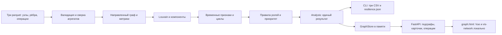

# Архитектура «Графа денег»

## Схема решения

Текстовая цепочка для просмотра без Mermaid:
**parquet → валидация → граф/метрики → кластеры/типологии → роли/приоритет → CSV и API → интерфейс**.

## Компоненты

| Компонент | Назначение |
|---|---|
| pipeline/graph.py | Загрузка, сверка с транзакциями, метрики, компоненты, Louvain |
| pipeline/roles.py | THRESHOLDS, порядок правил, evidence и формула рейтинга |
| pipeline/typologies.py | Повторные суммы, сопоставление по датам, синхронные входящие, циклы, устойчивость |
| pipeline/analysis.py | Один расчёт для CLI и API; таблицы и сводка кластеров |
| pipeline/run.py | CLI, запись CSV и оценки удаления топа |
| app/graph_store.py | Результат анализа в памяти и запросы к нему |
| app/main.py | FastAPI, статические файлы, валидация HTTP-параметров |
| app/summary.py | Сводка всей активной выгрузки, крупнейшие связи и потоки между ролями |
| app/responses.py | Безопасная для JavaScript сериализация gid строками |
| web/graph.html | Поиск, навигация, фильтры, карточки клиентов и связей |
| web/summary.js, web/summary.css | Компактная сводка, подробные таблицы и переходы к узлам |
| web/upload.html | Загрузка и активация проверенного набора parquet |
| web/vendor/ | Зафиксированные JS-библиотеки, лицензии, SHA-256 |

## Жизненный цикл и решения

CLI и сервер вызывают `pipeline.analysis.analyze`. HTTP API вычисляет результат
при старте и при загрузке нового набора, а не на каждый запрос. Ручная замена
файлов требует перезапуска; форма загрузки переключает результат сразу.
Ошибки схемы и несовпадение агрегатов отклоняют набор. Сервер без готовых
данных остаётся доступным для загрузки через `/upload.html`.

Направление денег хранится в DiGraph. Только для Louvain используется
неориентированная проекция с суммой встречных потоков. Изоляты не теряются.
Начальный seed кластеризации фиксирован; одинаковые приоритеты сортируются по gid.

Пороги и признаки объяснимы, внешняя модель не назначает роли. Коэффициенты
рейтинга — эвристика, которую нужно защищать и проверять на чувствительность.
API раскрывает составляющие приоритета. Поиск кратчайшего пути не учитывает
временную возможность движения одних и тех же средств.

Фронтенд без сборки: библиотеки поставлены локально, сервер отдаёт их из
`web/vendor`. Данные загружаются только из локального API. Внешние запросы
для расчёта и экрана расследования не нужны. Swagger `/docs` — вспомогательный
экран; для автономного изучения контракта есть `/openapi.json` и `app/API.md`.

Старые `app/llm.py`, `app/db.py`, `/api/items`, `/api/generate` и `/` остались
от стартового каркаса. SQLite хранит его записи, а не основной граф. LLM
не имеет доступа к графу и не является AI-ассистентом расследования.

## Границы реализации

Один процесс и расчёт в памяти подходят для датасета трека. Не реализованы
многопользовательская авторизация, аудит, инкрементальный пересчёт и распределённая
обработка. Стратегия на миллион узлов описана в README и не выдаётся за готовую.
На экране ограничены объём подграфа и число возвращаемых операций; ограничения
показываются пользователю. Расчёт не восстанавливает отсутствующие операции.

## Загрузка и активация новой версии

Форма `/upload.html` отправляет три файла в `/api/data/upload`. Сервер
принимает одну загрузку за раз, проверяет набор в staging-каталоге и строит
новый GraphStore. Только после успешного расчёта создаётся неизменяемая версия,
атомарно заменяется указатель на диске и переключается граф в памяти.
При ошибке прежняя версия остаётся активной. При старте сначала читается
указатель, при его отсутствии — исходный `DATA_DIR`. Это локальный режим
одного процесса; распределённая синхронизация и удаление версий не реализованы.
